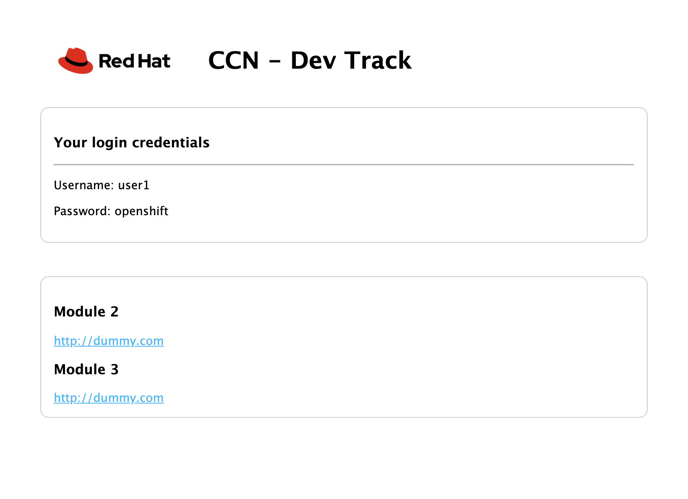

# username-distribution app

This web app distributes usernames and passwords to individuals who are taking part in an OpenShift based workshop. Deploying this app in OpenShift and exposing it publicly will give users a central access point, giving them their individual login credentials and links to lab guides.



## How to Use

### Deploy to OpenShift

You can deploy the application from your local host to OpenShift by running the following commands:

```bash
# first login to your cluster
oc login

# clone this repo, install deps, and deploy
git clone <this-repo-url> username-distribution
cd username-distribution
npm install
npm run deploy
```

The application will be deployed to a namespace called `user-distribution` with a public facing route exposed.

### Configuration

#### Via Environment Variables

You can set these variables via a `Deployment` or `DeploymentConfig`, or by mounting a file named `.env` (see the `.env.example` in this repo) into the root of the application directory in the Pod running it.

*NOTE: The `.env.example` is ignored by the application. Copy it and rename to `.env` to use it locally and as part of the `npm run deploy` script.*

| Name | Default | Description |
| ---- | ------- | ----------- |
| LAB_TITLE | OCP4 Workshop | This title will be displayed at the top of the page |
| LAB_DURATION_HOURS | 2h | The length of the event. Should be in a format per [timestring docs](https://www.npmjs.com/package/timestring) |
| LAB_USER_COUNT | 50 | The number of available user logins |
| LAB_USER_PASS | openshift | The default password for all users |
| LAB_BLOCKLIST | [] | Comma separated list of user numbers to block off. These numbers will not be assigned |
| LAB_USER_PREFIX | evals | The username prefix for each account (eg. evals1, evals2) |
| LAB_MODULE_URLS | [] | Comma separated list of modules, e.g "https://module.a,https://module.b" |
| LAB_USER_PAD_ZERO | false | Determines if user should be formatted as evals01 or "evals1" when user number is less than 10 |


#### Via Code

Edit the *config.js* file and deploy in OpenShift. See below config values and descriptions

| name | default | description |
| ---- | ------- | ----------- |
| eventTitle | OCP4 Workshop | This title will be displayed at the top of the page |
| eventHours | 2h | The length of the event. Should be in a format per [timestring docs](https://www.npmjs.com/package/timestring) |
| accounts.number | 50 | The number of available user logins |
| accounts.password | "openshift" | The default password for all users |
| accounts.blockedUsers | [] | Comma separated list of user numbers to block off. These numbers will not be assigned |
| accounts.prefix | evals | The username prefix for each account (eg. {prefix}1, {prefix}2) |
| modules | [] | Comma separated list of modules, e.g "https://module.a,https://module.b" |
