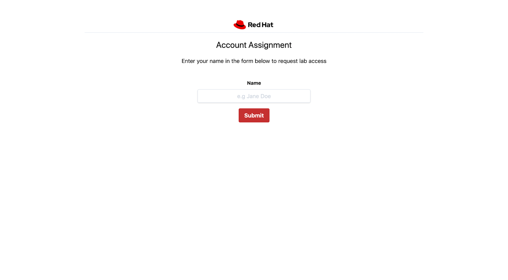
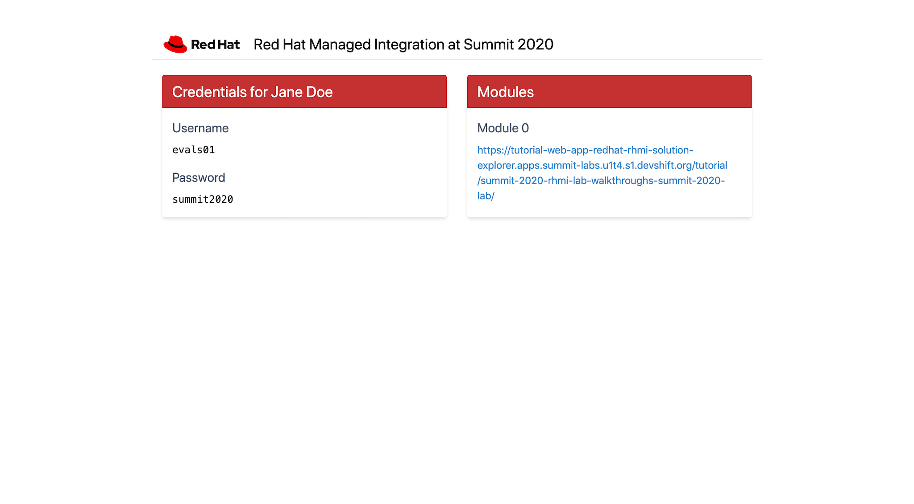
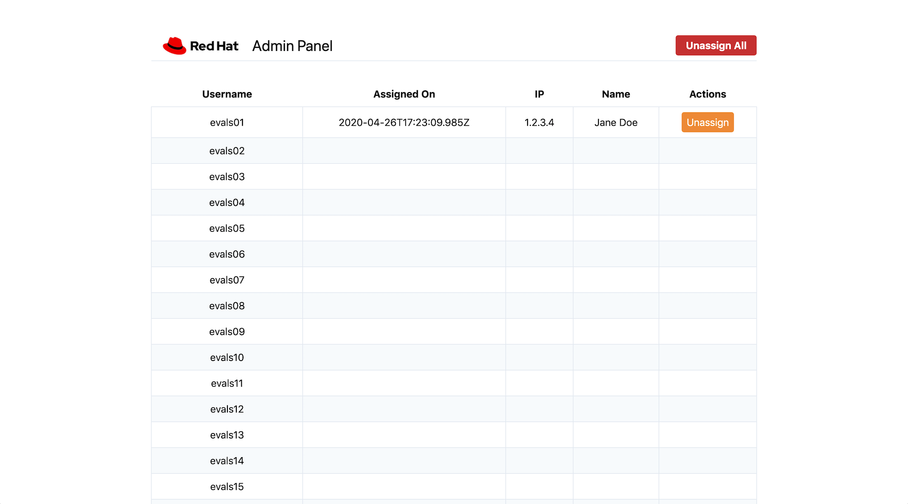

# username-distribution app

This web app distributes usernames and passwords to individuals who are taking part in an OpenShift based workshop. Deploying this app in OpenShift and exposing it publicly will give users a central access point, giving them their individual login credentials and links to lab guides.

First, a user must enter their name so they can be identified:



Then, they will be assigned a lab account if one is available:



## Build and Push this as an Image

A *scripts/* directory includes *build* and *push* scripts to create a build
using the [s2i](https://github.com/openshift/source-to-image) CLI, and push it
to [quay.io](https;//quay.io).

Sample usage:

```bash
# This can take a while depending on your connection speed and machine specs
./scripts/image.build.sh

# Pushes the image to quay.io for the specified user.
# This is bound by your upload speed...so be patient ☕
QUAY_USER=your-username ./scripts/image.build.sh
```

## How to Use

No matter what deployment option you choose below, ensure you set the
environment variables described in the configuration section of this README.

### Deploy to OpenShift using NodeShift

*NOTE: This will use an in-memory store for sessions. If you restart/redeploy the application all state will be lost.*

You can quickly deploy the application from your local host to OpenShift by running the following commands:

```bash
# first login to your cluster
oc login

# clone this repo, install deps, and deploy
git clone <this-repo-url> username-distribution
cd username-distribution
npm install
npm run deploy
```

The application will be deployed to a namespace called `user-distribution` with a public facing route exposed.

### Deploy using OC CLI

*NOTE: This method will use Redis to store session state. This means you can restart/redeploy the Node.js application without losing state. An example of flushing state is included below.*

Run the following commands inside this repo:

```bash
oc login
oc new-project username-distribution
oc create -f openshift/project.json
```

If you'd like to flush the application state, i.e invalidate all assigned
sessions/logins, run the following commands, or visit the `/admin` page of
the application:

```bash
oc project username-distribution

# get the redis pod, and redis password
REDIS_POD=$(oc get pods -l deploymentconfig=redis -o jsonpath='{.items[0].metadata.name}')
REDIS_PASS=$(oc get secrets/redis -o jsonpath='{.data.database-password}' | base64 -D)

# execute a FLUSHALL redis command in the pod to delete user
# reservations and stored user session tokens
oc exec $REDIS_POD -- bash -c "redis-cli -a $REDIS_PASS FLUSHALL"
```

### Configuration

#### Via Environment Variables

You can set these variables via a `Deployment` or `DeploymentConfig`, or by mounting a file named `.env` (see the `.env.example` in this repo) into the root of the application directory in the Pod running it.

*NOTE: The `.env.example` is ignored by the application. Copy it and rename to `.env` to use it locally and as part of the `npm run deploy` script.*

| Name | Default | Description |
| ---- | ------- | ----------- |
| LAB_TITLE | OCP4 Workshop | This title will be displayed at the top of the page |
| LAB_DURATION_HOURS | 2h | The length of the event. Should be in a format per [timestring docs](https://www.npmjs.com/package/timestring) |
| LAB_USER_COUNT | 50 | The number of available user logins |
| LAB_USER_PASS | openshift | The default password for all users |
| LAB_USER_ACCESS_TOKEN | redhatlabs | Access token required to join the lab. Give this to your users. |
| LAB_BLOCKLIST | [] | Comma separated list of user numbers to block off. These numbers will not be assigned |
| LAB_USER_PREFIX | evals | The username prefix for each account (eg. evals1, evals2) |
| LAB_MODULE_URLS | [] | Comma separated list of modules and module names, e.g "https://module.a;Lab 1,https://module.b;Lab2" |
| LAB_USER_PAD_ZERO | false | Determines if user should be formatted as evals01 or "evals1" when user number is less than 10 |
| LAB_ADMIN_PASS | pleasechangethis | The password used to login at the /admin URL |
| LAB_REDIS_HOST | not set | The Redis instance to use. Provide only the hostname, and no port |
| LAB_REDIS_PASS | not set | The password used to access Redis |
| LAB_SESSION_SECRET | Randomly generated on startup | The secret used to sign cookies. Set this |

#### Via Code

Edit the *config.js* file and deploy in OpenShift. See above config values and descriptions.

## Administration

As an admin, you can access the admin dashboard via the `/admin` route, e.g
`http://localhost:8080/admin`. You will be prompted for a username and password
to authenticate - use the following values:

* Username: `admin`
* Password: The value of `LAB_ADMIN_PASS` (default is `pleasechangethis`)

From the admin dashboard you can:

* See assigned accounts and the name of the person using it
* Revoke all user assignments - basically a reset button
* Unassign individual users - this will let someone else claim the account



